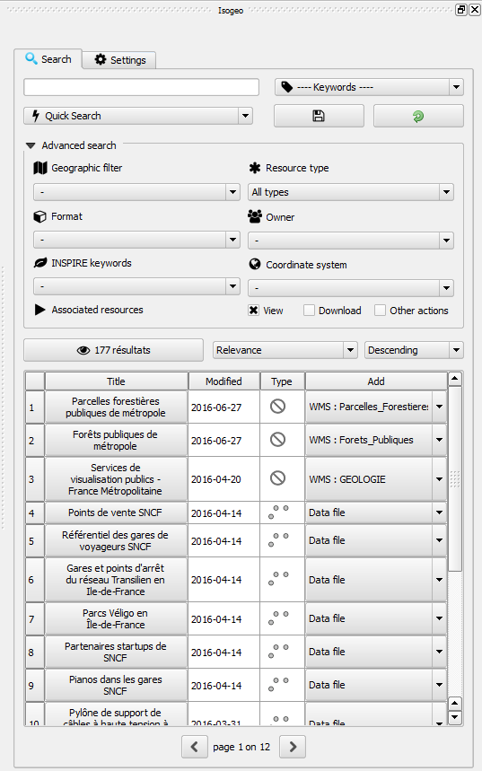
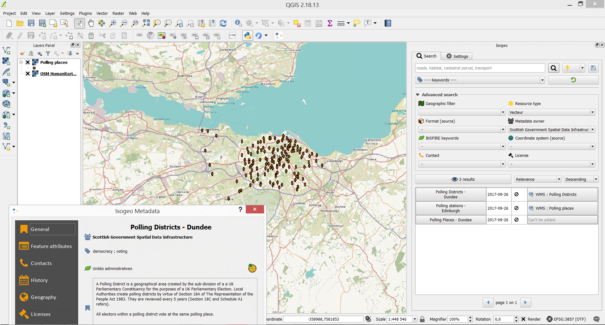

# Isogeo for QGIS

QGIS plugin for [Isogeo](http://www.isogeo.com/), a SaaS software to give an easier access to geodata.
Equivalent of [plugins for ArcGIS](http://www.isogeo.com/applications/).

You can see and vote for [this plugin on the official QGIS extensions website](http://plugins.qgis.org/plugins/isogeo_search_engine/).

[Online documentation is available here)(https://www.gitbook.com/book/isogeo/app-plugin-qgis/details).

## Purpose ##

Allow Isogeo users to search for datas in their own and external metadata catalogs and add it to a QGIS project. Its goal is to improve access to internal and external geodata.

## How does it works ##

### Technical 

It's based on Isogeo API:
* REST-ful
* oAuth2 protocol used to authenticate shares

It's fully integrated with QGIS ecosystem:
* PyQGIS 2
* PyQt 4.8.x

### Features

- [X] Text search among Isogeo shares
- [X] Dynamic filter on keywords, INSPIRE themes, catalog owners, source coordinate system and available links
- [X] Geographic filter from a layer bounding box
- [X] Geographic filter from the map canvas bounding box
- [X] Order results by relevance, alphabetic, last updated date (data or metadata), creation date (data or metadata)
- [X] Add the related data directly to the map canvas throught raw data or web services
- [X] Display full metadata information in a separated window
- [X] Save search bookmarks
- [ ] Customize and manage data lists

## Screen captures ##

| Without any search | With some filters |
|:------------------:|:-----------------:|
|  |  |

## Getting started ##

In a nutshell:

1. QGIS *Plugins* menu -> *Manage and Install Plugins...*;
2. Search for *isogeo*, select it and install it.

If you want a more advanced version, check the box allowing experimental extensions in settings.

See the documentation:

* en [français](doc/install_FR.md) ;
* in [English](doc/install_EN.md).

## Authors ##

First version developed during the internship of [Théo SINATTI](https://github.com/TheoSinatti) supervised by [Julien Moura](https://github.com/Guts), at Isogeo: http://www.isogeo.com.

Since version 1.2, it's developed by [Julien Moura](https://github.com/Guts) for Isogeo.

## Sponsors ##

This plugin is made thanks to some Isogeo active clients:

