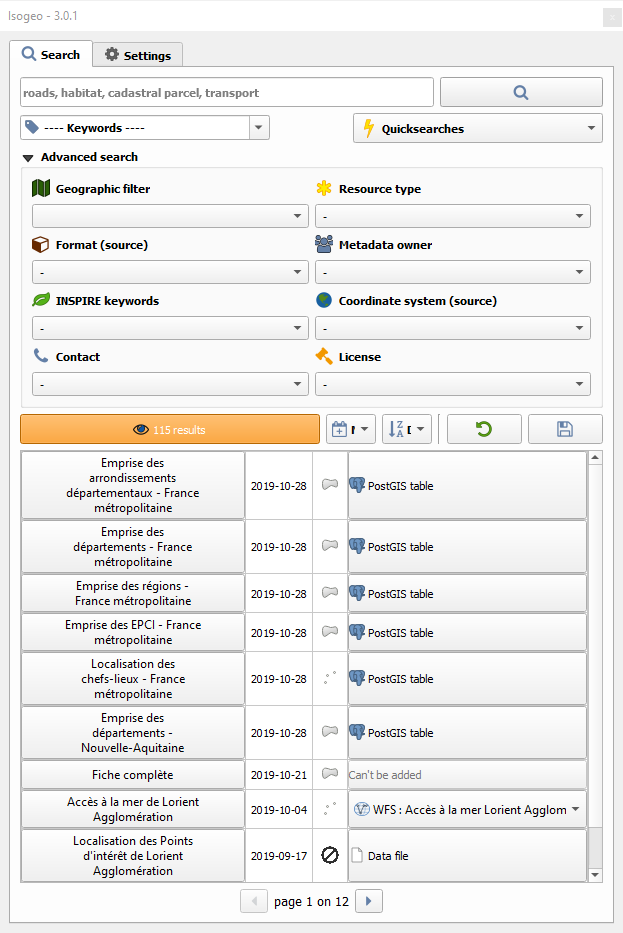
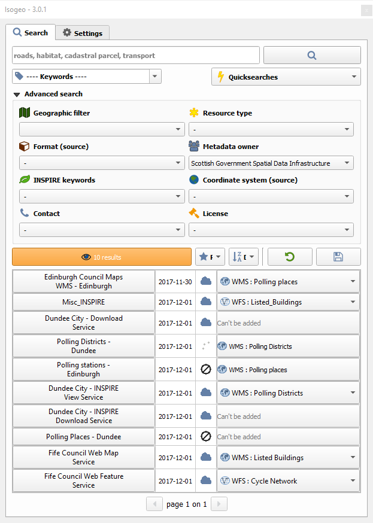
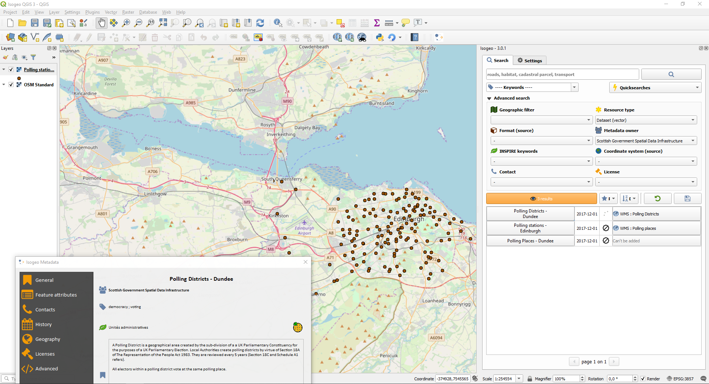

# Isogeo for QGIS

QGIS plugin from [Isogeo](https://www.isogeo.com/), a SaaS software to give an easier access to geodata.
Equivalent of [plugins for ArcGIS](https://www.isogeo.com/nos-produits/Plugins-Widgets).

You can see and vote for [this plugin on the official QGIS extensions website](https://plugins.qgis.org/plugins/isogeo_search_engine/).

[Online documentation is available here](http://help.isogeo.com/qgis/).

## Purpose

Allow Isogeo users to search for datas in their own and external metadata catalogs and add it to a QGIS project. Its goal is to improve access to internal and external geodata.

## How does it works

### Technical

It's based on Isogeo API:

* REST-ful
* oAuth2 protocol used to authenticate shares

It's fully integrated with QGIS ecosystem:

* PyQGIS 3
* PyQt 5.11.x

### Features

* [X] Text search among Isogeo shares
* [X] Dynamic filter on keywords, INSPIRE themes, group themes, catalog owners, source coordinate system, license, data type (vector, raster...), source format and contacts
* [X] Geographic filter from a layer bounding box
* [X] Geographic filter from the map canvas bounding box
* [X] Order results by relevance, alphabetic, last updated date (data or metadata), creation date (data or metadata)
* [X] Add the related data directly to the map canvas throught raw data or web services
* [X] Display full metadata information in a separated window
* [X] Save search bookmarks

## Screen captures

| Without any search | With some filters |
|:------------------:|:-----------------:|
|  |  |

## Getting started

In a nutshell:

1. QGIS *Plugins* menu -> *Manage and Install Plugins...*;
2. Search for *isogeo*, select it and install it.

If you want a more advanced version, check the box allowing experimental extensions in settings.

See the documentation:

* en [français](http://help.isogeo.com/qgis/fr/) ;
* in [English](http://help.isogeo.com/qgis/en/).
