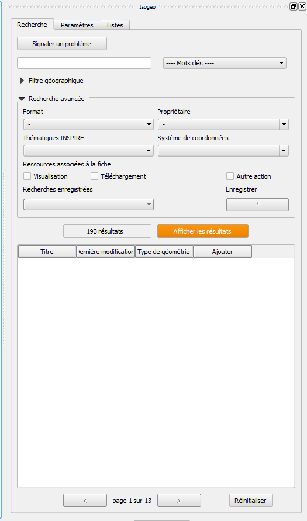

# Isogeo for QGIS

QGIS plugin for [Isogeo](http://www.isogeo.com/), a SaaS software to give an easier access to geodata.
Equivalent of [plugins for ArcGIS](http://www.isogeo.com/applications/).

## Purpose ##

* allow Isogeo users to search for datas in their metadata catalogs and add it to a QGIS project ;
* this is still an **experimental plugin** (waiting for QGIS approbation before to be distributed inside the epxrimental release channel)

## How does it works ##

### Technical 

It's based on Isogeo API:
* REST-ful
* oAuth2 protocol used to authenticate shares

It's fully integrated with QGIS ecosystem:
* PyQGIS 2
* PyQt 4.8.x

### Features

- [X] Text search among Isogeo shares
- [X] Dynamic filter on keywords, INSPIRE themes, catalog owners, source coordinate system and available links
- [ ] Geographic filter from a layer bounding box
- [ ] Geographic filter from the map canvas bounding box
- [ ] Order results by relevance, alphabetic, last updated date (data or metadata), creation date (data or metadata)
- [ ] Add the related data directly to the map canvas
- [ ] Display full metadata information in a separated window
- [ ] Save search bookmarks
- [ ] Customize and manage data lists

## Screen captures ##

| Without any search | With some filters |
|:------------------:|:-----------------:|
|  |  |

## Getting started ##

In a nutshell:
1. QGIS 'Plugins' menu -> 'Manage and Install Plugins...'
2. Search for 'isogeo' and select it
3. 'Install Plugin'

See the documentation:

* en [français](doc/install_FR.md) ;
* in [English](doc/install_EN.md).

## Authors ##

[Théo SINATTI](@TheoSinatti).
This internship was supervised by [Julien Moura](@Guts), Isogeo: http://www.isogeo.com

## Sponsors ##

This plugin is made thanks to some clients:

