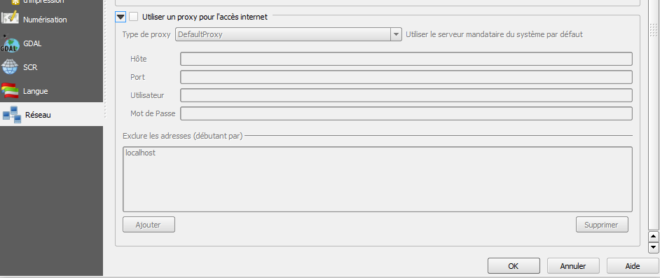

# Install the Isogeo plugin for QGIS

## Process ###

1. Request your application credentials sendin a mail mail to [projets+qgis@isogeo.fr](mailto:projets+qgis@isogeo.fr?subject=[Plugin QGIS] Credentials request) specifiying which Isogeo workgroups are concerned;
2. Once you got the answer, create a share to the application *QGIS Plugin* in the administration console on [APP](https://app.isogeo.com);

    

3. Download and unzip the last version in `C:\Users\%USERNAME%\.qgis2\python\plugins`;
4. Check your network settings in QGIS (proxy...)) ;

    

5. Activate the extension in the plugin manager of QGIS:

    

6. Enter access id and secret sent by mail:

    

Everything is ready!
Enjoy your geo search :)
