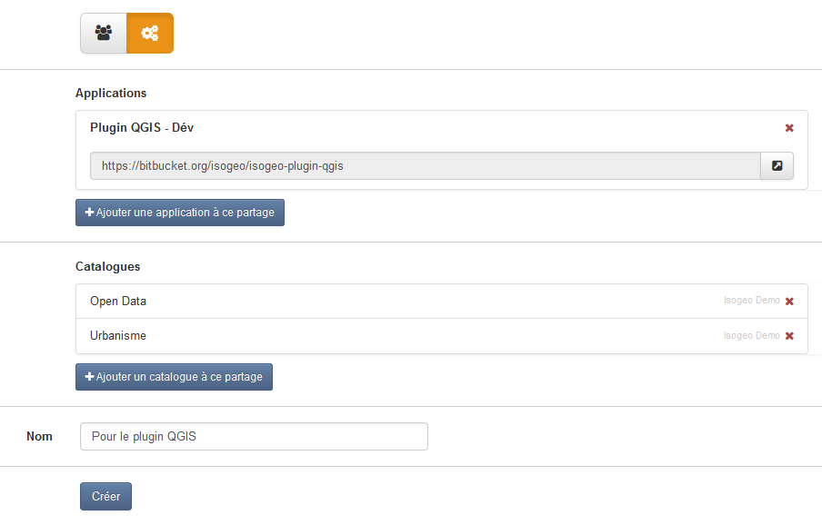
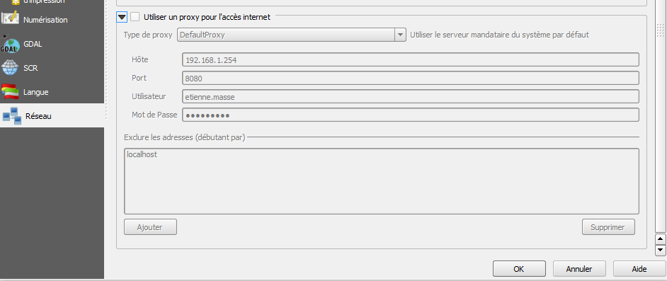
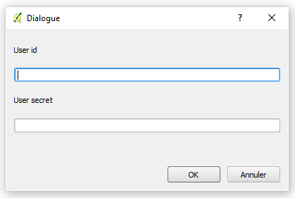

# Installer le plugin QGIS

### Procédure ###

1. Demander la création de votre application en envoyant un mail à [projets+qgis@isogeo.fr](mailto:projets+qgis@isogeo.fr?subject=[Plugin QGIS] Demande d'accès) en indiquant quel(s)) groupe(s) de travail est/sont concerné(s) ;
2. Une fois la réponse reçue, créer un partage vers l'application *Plugin QGIS* dans l'administration des partages sur [APP](https://app.isogeo.com) ;

    

3. Télécharger la dernière version du plugin et décompresser dans `C:\Users\%USERNAME%\.qgis2\python\plugins` ;
4. Vérifier les paramètres réseau dasn QGIS (proxy...)) ;

    

5. Activer l'extension via le gestionnaire de plugins de QGIS :

    

6. Entrer les identifiants reçus par mail au premier lancement du plugin :

    

Voilà c'est fait !
Bonnes recherches :)
