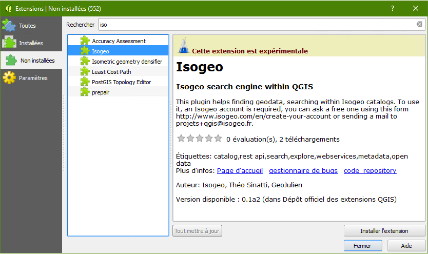

# Installer le plugin QGIS

Toujours en phase de développement active, il est possible d'installer le plugin de deux façons différentes :

* pour les utilisateurs standards, via le canal expérimental du gestionnaire d'extensions intégré à QGIS ;
* pour les utilisateurs avancés, via le téléchargement du dépôt.

### Procédure ###

1. Demander la création de votre application en envoyant un mail à [projets+qgis@isogeo.fr](mailto:projets+qgis@isogeo.fr?subject=[Plugin QGIS] Demande d'accès) en indiquant quel(s)) groupe(s) de travail est/sont concerné(s) ;

2. Une fois la réponse reçue, créer un partage vers l'application *Plugin QGIS* dans l'administration des partages sur [APP](https://app.isogeo.com) ;

    
3. Dans QGIS, vérifier les paramètres réseau (proxy...) via le menu *Préférences* > *Options...* ;

    

4. Installer le plugin :
    * Utilisateurs standards :
        1. Dans QGIS, ouvrir le Gestionnaire d'extensions : menu *Extension* > *Installer/Gérer les extensions...* ;
        2. Dans *Paramètres*, activer les extensions expérimentales :

            
    
        3. Il est aussi recommandé d'activer les mises à jour à chaque démarrage ou au moins hebdomadaires.

    * Utilisateurs avancés :

        1. Télécharger la [dernière version du plugin](https://github.com/isogeo/isogeo-plugin-qgis/releases) ;
        2. Décompresser dans `C:\Users\%USERNAME%\.qgis2\python\plugins` pour Windows ou `/home/$USER/.qgis2/python/plugins` pour Ubuntu ;

5. Activer l'extension via le gestionnaire de plugins de QGIS :

    

6. Entrer les identifiants reçus par mail au premier lancement du plugin :

    

Voilà c'est fait !
Bonnes recherches :)
